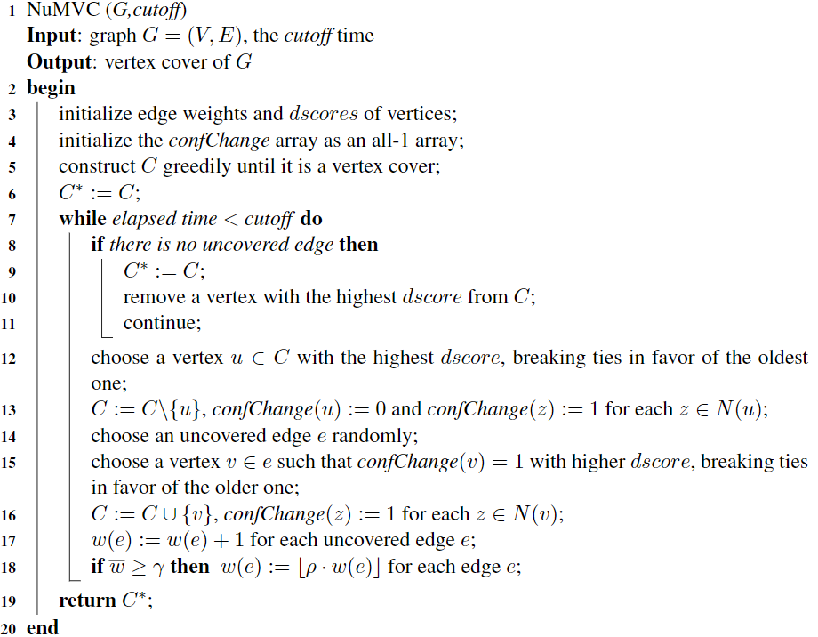

# MaxClique
Heuristic solution for solving max clique problem.

### Note

核心代码

- `remove`：将和节点v相关的所有边e移出L
- `insert`：将和节点v相关的未被覆盖边e插入到L的表头
  - 未被覆盖边：e的另一顶点u不能在部分点覆盖C中
- `resize`：**TODO** 将点覆盖C的大小缩小至`ub-delta`，方法是依次移除dscore最高的顶点，将这些顶点的关联的未覆盖边插入到L中
- `greedyVC`：将部分点覆盖C扩展成点覆盖，方法是依次加入关联L中未覆盖边数目最多的顶点
- `chooseSwapPair`：**TODO** 依照论文实现
- `EWLS`：**两处TODO** EWLS算法实现，分为init部分和迭代部分

### Road Map

- [ ] 4处**TODO**的修改，按照论文中的说明需要random选择元素
- [ ] 实现EWLS的升级版——EWCC算法
- [ ] 对代码实现进行性能调优（施工中）
- [ ] 调参工程：选择合适的`delta`和`maxSteps`

### Reference

[Cai, Shaowei, Kaile Su, and Abdul Sattar. "Local search with edge weighting and configuration checking heuristics for minimum vertex cover." *Artificial Intelligence* 175.9-10 (2011): 1672-1696.](https://www.sciencedirect.com/science/article/pii/S0004370211000427)

### Added by 张苏：

&emsp;&emsp;Trying to 实现蔡少伟老师13年发的paper的NuMVC算法，论文里展示的效果来看是要比EWLS和EWCC好的。目前我的进度拖了...只写了一点，后面得等考完操统再继续了.下面把论文的内容总结出来，大家这两天有时间的也可以看明白了接着写一下。

首先论文链接：[Shaowei Cai, Kaile Su, Chuan Luo, Abdul Sattar. NuMVC: An Efficient Local Search Algorithm for Minimum Vertex Cover](https://arxiv.org/abs/1402.0584)

主要定义也与EWLS一样，也是对每个边加上权重，包括`cost(G,X)`、`dscore(v)`这些定义也一样，过程是一个`Two-Stage Exchange(TSE)`和一个`Edge Weighting with Forgetting`，就是一个分两个阶段的变换和边权值的遗忘机制（遗忘机制我觉得可能可以直接加到EWLS里面试试效果）

##### 1. TSE:
在每次迭代中， NuMVC首先选择具有最高dscore的顶点u∈C并将其移除。 之后，NuMVC 随机选择一个未覆盖边e，并选择e的满足一定的[条件](#1)的端点中dscore较大的点加入C中.
##### 2. 边权遗忘机制：
每次迭代末尾会检查当前的权值平均$\bar{w}$如果达到某个阈值就要对所有边的权值进行减小，，这里.
##### 3. Configuration Checking(CC)机制
说这个策略是为了解决循环搜索的问题，起到类似于禁忌搜索的作用。依靠ConfChange数组来进行检查：一开始对每个端点把ConfChange数组初始化为1，之后，当顶点v是从C中被删除时，confChange(v)被重置为0，并且当顶点v改变其状态(0到1、1到0)时，为每个z∈N(v)，即其相邻的点z，confChange(z)设置为1。原则是confchange为0的点是拒绝加入C中的。之前TSE的第二阶段要满足的条件也就是，这个端点的confchange状态需要为1(即伪代码15行).

伪代码：

此外，蔡少伟老师自己实现的code见于`Cai-numvc.cpp`、`Cai-tsewf.h`中。